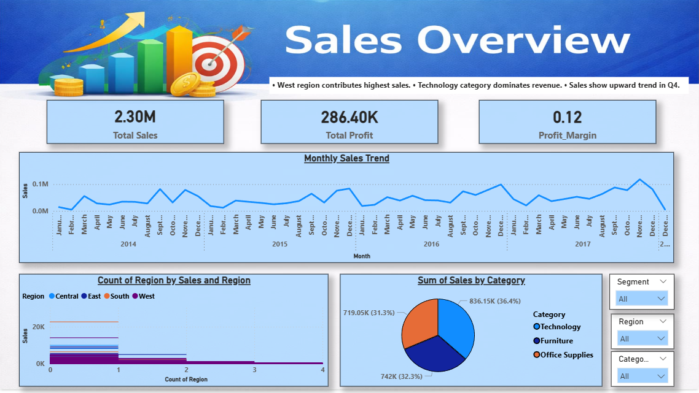
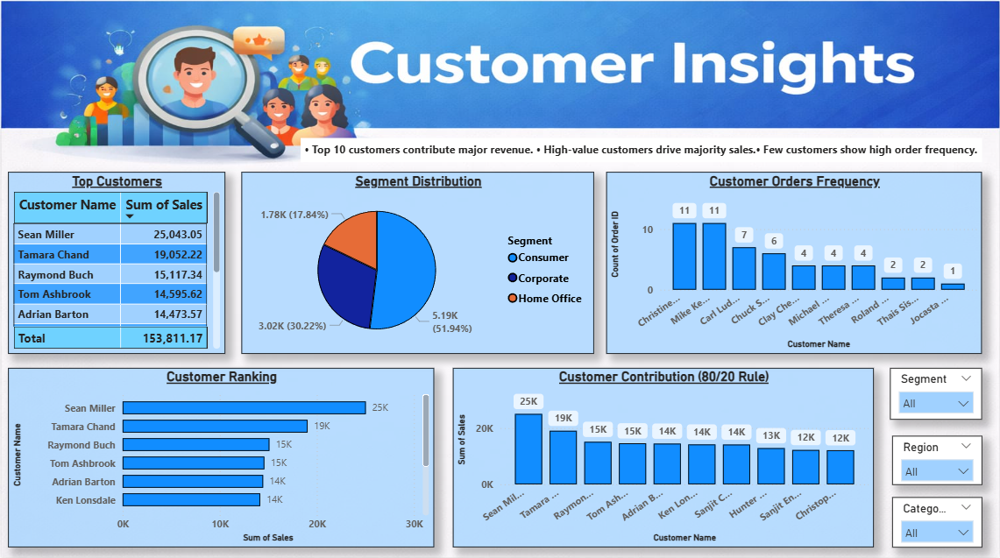
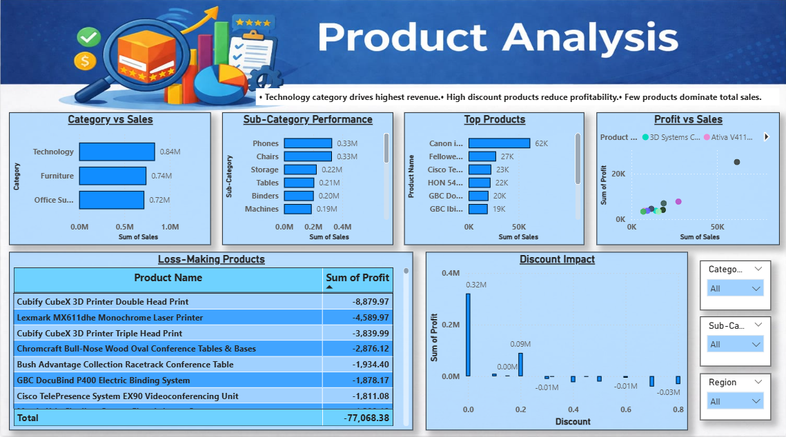

# 📊 Superstore Sales Analysis (End-to-End Project)

## 📌 Project Overview

This project analyzes retail sales data using **SQL, Excel, Python, and Power BI** to generate actionable business insights.

---

## 🛠 Tech Stack

* SQL (MySQL)
* Excel (Data Cleaning, Pivot Tables)
* Python (Pandas, Matplotlib, Seaborn)
* Power BI (Data Visualization & Dashboarding)

---

## 📂 Project Structure

```
data/       → Dataset  
excel/      → Excel analysis & preprocessing  
sql/        → SQL queries  
python/     → Data analysis & EDA  
powerbi/    → Dashboard (.pbix)  
images/     → Dashboard screenshots  
```

---

## 📊 Dashboard Pages

### 🔹 1. Sales Overview



**Insights:**

* Tracks total sales, profit, and profit margin
* Monthly trend analysis
* Region-wise performance
* Category-wise contribution

---

### 🔹 2. Customer Insights



**Insights:**

* Identifies top customers
* Customer segmentation (High / Medium / Low)
* Pareto analysis (80/20 rule)
* Customer order behavior

---

### 🔹 3. Product Analysis



**Insights:**

* Top-selling products
* Loss-making products
* Discount vs Profit relationship
* Sales vs Profit comparison

---

## 📊 Excel Work

* Data cleaning (handling missing values, formatting)
* Pivot tables for quick summaries
* Initial trend analysis before SQL & Python

---

## 🧠 Key Business Insights

* Top 20% customers contribute majority of revenue (Pareto Principle)
* Some products generate losses despite high sales
* Discounts negatively impact profit margins
* Sales show seasonal trends

---

## 🚀 How to Use

1. Open `.pbix` file in Power BI
2. Explore interactive dashboards
3. Use filters to analyze different segments

---

## 👤 Author

Dhruv Prasad
